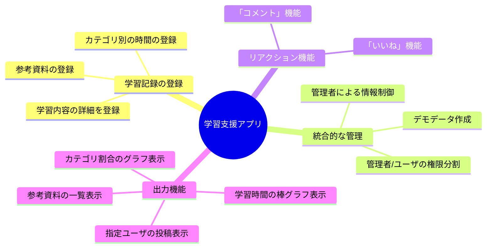

# 1.課題作成の目的

これまでのPython学習で得た知識をアウトプットする事を目的としています。
Python Flask と PostgreSQL を組み合わせた、リレーショナルデータベース（RDB）の設計・操作スキルの習得を主眼に置いています。
自身の学習過程で得た技術的な知見を「記憶メモ」として整理する役割も兼ねて、詳細説明を行っています。
ここでの説明だけでは分かりにくい面もあるので、読者の皆様にも実践できる様に、Docker環境の構築にも挑戦しましたので、興味のある方は使用して頂ければと思っています。


# 2.アプリ概要

本アプリは、PostgreSQLのリレーショナル特性を活かし、学習内容の「時間」「資料」というデータを記録していき、後日に見える形に出力する事で、振り返りの質を高めることを目的としています。




## 📥 入力（インプット）

リレーショナルデータベースを活かした学習実績の登録を行います。

*   **基本情報の登録**
    *   学習実績の「タイトル」、「詳細内容」を登録。
    *  「学習カテゴリ」と「学習時間」を紐付けて登録。
*   **参考情報の保存**
    *   学習に使用した参考URLに対し、「カテゴリー」、「自己評価」を付与して保存。
*   **コミュニケーション**
    *   「いいね」、「コメント」によりユーザ同士の交流。
*   **統合的な管理**
    *   管理者がユーザー情報、カテゴリ情報、デモストレーションデータを一括管理する。

## 📊 出力（アウトプット）：実績の振返り

蓄積データの視覚的なフィードバックを用意しています。

### 1. 学習状況の可視化（ビジュアライゼーション）

| 種類 | 内容 | 目的 |
| :--- | :--- | :--- |
| **棒グラフ** | 1ヶ月/1年の学習時間合計 | 学習の継続性を時間軸で把握 |
| **円グラフ** | カテゴリ別の学習比率 | 注力度やスキルの偏りを把握 |

### 2. フィルタリング機能

| 目的 | 内容 |
| :--- | :--- |
| 情報共有 | 登録した参考資料を、評価やカテゴリーで絞った選別表示 |
| パーソナライズ | 特定ユーザーの活動履歴を選択表示 |


## ◆作成アプリ
作成アプリは、以下の2バージョンを用意しました。
内容はほぼ同じですが、、動作環境の関係から少しだけ異なっています。
ここからの説明は、「アプリ2(ローカルPC版)」に対して行います。

### 1. アプリ1(Herokuデプロイ版)
以下のURL に、アプリをデプロイしました。
https://study-support-apl-7e33842a0b97.herokuapp.com/
記事を読みながらインターフェースの感じを、簡単に見て頂ければと思っています。
こちらでは、サンプルデータを入力しているので、結果表示機能の幾つは使用できます。

### 2. アプリ2(ローカルPC版)
GitHub に登録したデータとなります。

ローカルPCで使用していたものとなり、Herokuへデプロイしたものとは少し異なります。
こちらには、Docker環境を設けたので、コードを編集しながらアプリの動きも見られます。


# 3.環境
提供環境は Windows 10 にて、Docker Desktop(28.5.2)を使用し動作確認しました。

## 3.1. 開発インフラ

|コンポーネント|技術・ツール|役割|
|:--|:--|:--|
|言語・ランタイム|Python 3.12|アプリケーションのメインロジック実行|
|データベース|PostgreSQL|学習データ、ユーザー情報の永続化（RDB）|
|DB管理ツール|Adminer|軽量で高速なDB管理用Webインタフェース|


## 3.2. 使用ライブラリ(Python)
| ライブラリ | バージョン |
|:--|:--|
|Flask|3.1.2|
|Flask-Admin|2.0.2|
|Flask-Login|0.6.3|
|Flask-Migrate|4.1.0|
|psycopg-binary|3.1.18|
|Flask-SQLAlchemy|3.1.1|

# 3.3 ディレクトリ構成

```
scr/
├─ app.py(Pythonアプリ)
├─ Dockerfile(アプリケーションコンテナのビルド定義)
├─ compose.yaml(Docker Compose関連の設定ファイル)
├─ requirements.txt(Pythonの依存関係リスト)
├─ static/
│  └─ js
│  　　└─ JavaScript
├─ templates/
│   └─ HTMLテンプレート
└─ postgres/
   └─ compose.yaml(Docker Compose関連の設定ファイル)
```


# 5.Docker実行方法

:::message
**【①実行ディレクトリへ移動】**
GitHub　にあるデータの`./src`の下に移動して下さい。
ここに、以下のDocker用ファイルが用意されている事を確認して下さい。
compose.yaml
Dockerfile
requirements
:::
:::message
**【②Dockerコマンド実行】**
複数のコンテナを起動するコマンドとなります。
```shell-session
>docker compose up -d --build
```
